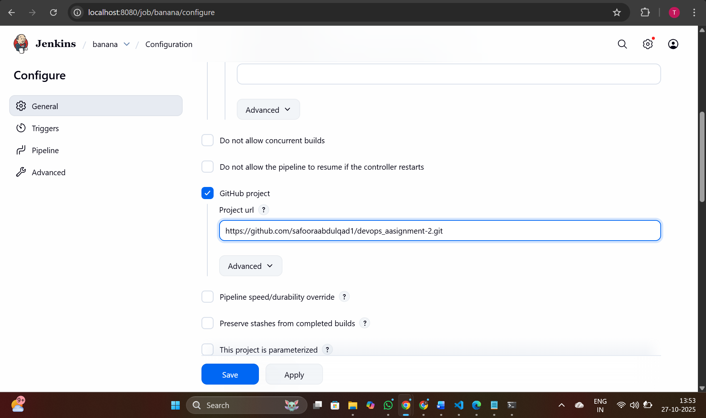

# TableBook — Table Booking System


A production-ready Flask web application with complete CI/CD pipeline using Jenkins, Docker, and Kubernetes deployment.

## 🎯 Overview

This project demonstrates a complete DevOps workflow for a Flask web application, including:

- Containerized application using Docker
- Automated CI/CD pipeline with Jenkins
- Kubernetes orchestration for production deployment
- Automated testing and deployment stages

## Screenshots

Jenkins CI/CD


Jenkins configuration


Github Repository


Kubernetes Services Running using minikube


Website view


## Quick links (workspace files & key symbols)
- Files:
  - [app.py](app.py)
  - [templates/index.html](templates/index.html)
  - [Dockerfile](Dockerfile)
  - [k8s/deployment.yaml](k8s/deployment.yaml)
  - [k8s/service.yaml](k8s/service.yaml)
  - [Jenkinsfile](Jenkinsfile)
  - [requirements.txt](requirements.txt)
  - [.dockerignore](.dockerignore)
  - [.gitignore](.gitignore)
  - [kubectl-config.yaml](kubectl-config.yaml)
  - [screenshots/](screenshots/)
- Key symbols:
  - Flask app instance: [`app`](app.py)
  - Flask route handler: [`index`](app.py)
  - Client-side functions: [`renderTables`](templates/index.html), [`confirmBooking`](templates/index.html)

## File structure
```
.
├── .dockerignore
├── .gitignore
├── Dockerfile
├── Jenkinsfile
├── README.md
├── app.py
├── requirements.txt
├── kubectl-config.yaml
├── k8s/
│   ├── deployment.yaml
│   └── service.yaml
├── templates/
│   └── index.html
└── screenshots/
```

## Run locally (development)
1. Create a virtualenv and install deps:
```bash
python -m venv .venv
# Activate the venv (platform dependent)
# Windows:
.venv\Scripts\activate
# macOS / Linux:
source .venv/bin/activate

pip install -r requirements.txt
```

2. Start the app (development server):
```bash
python app.py
# App listens on http://0.0.0.0:8000 (open http://localhost:8000 in your browser)
```

3. Notes:
- The Flask entrypoint is [`app`](app.py) and route [`index`](app.py) renders [`templates/index.html`](templates/index.html).
- For production WSGI, use the same Gunicorn command used in the Dockerfile.


## Kubernetes — deploy & inspect
Apply manifests:
```bash
kubectl apply -f k8s/deployment.yaml
kubectl apply -f k8s/service.yaml
```

Check rollout & status:
```bash
kubectl rollout status deployment/devops-assignment-2 --timeout=180s
kubectl get deployments -o wide
kubectl get pods -o wide
kubectl get svc
```


